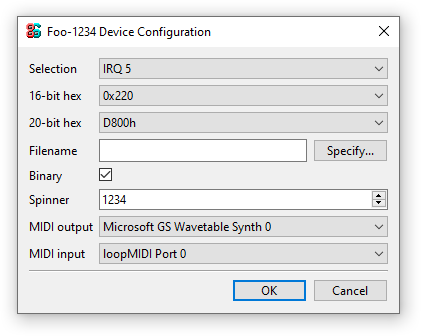

Devices
=======

The **device** is the main unit of emulated components in 86Box. Each device is represented by one or more constant ``device_t`` objects, which contain metadata about the device itself, several callbacks and an array of user-facing configuration options. Unless otherwise stated, all structures, functions and constants in this page are provided by ``86box/device.h``.

.. flat-table:: device_t
  :header-rows: 1
  :widths: 1 1 999

  * - :cspan:`1` Member
    - Description

  * - :cspan:`1` name
    - The device's name, displayed in the user interface. ``"Foo-1234"`` for example. Suffixes like ``"(PCI)"`` are removed at run-time.

  * - :cspan:`1` internal_name
    - The device's internal name, used to identify it in the emulated machine's configuration file. ``"foo1234"`` for example.

  * - :cspan:`1` flags
    - One or more bit flags to indicate the expansion bus(es) supported by the device, for determining :ref:`device availability <dev/api/device:Availability>` on the selected machine:

      * ``DEVICE_ISA``: 8-bit ISA;
      * ``DEVICE_AT``: 16-bit ISA;
      * ``DEVICE_EISA``: EISA (reserved for future use);
      * ``DEVICE_VLB``: VESA Local Bus or proprietary equivalents;
      * ``DEVICE_PCI``: 32-bit PCI;
      * ``DEVICE_AGP``: AGP 3.3V;
      * ``DEVICE_AC97``: AMR, CNR or ACR;
      * ``DEVICE_PCJR``: IBM PCjr;
      * ``DEVICE_PS2``: IBM PS/1 or PS/2;
      * ``DEVICE_MCA``: IBM Micro Channel Architecture;
      * ``DEVICE_CBUS``: PC-98 C-BUS (reserved for future use);
      * ``DEVICE_COM``: serial port (reserved for future use);
      * ``DEVICE_LPT``: parallel port (reserved for future use).

  * - :cspan:`1` local
    - 32-bit value which can be read from this structure by the ``init`` callback.
      Use this value to tell different subtypes of the same device, for example.

  * - :cspan:`1` init
    - Function called whenever this device is initialized, either from starting 86Box or from a hard reset. Can be ``NULL``, in which case the opaque pointer passed to other callbacks will be invalid. Takes the form of:

      ``void *init(const struct device_t *info)``

      * ``info``: pointer to this ``device_t`` structure;
      * Return value: opaque pointer passed to the other callbacks below, usually a pointer to the device's :ref:`state structure <dev/api/device:State structure>`.

  * - :cspan:`1` close
    - Function called whenever this device is de-initialized, either from closing 86Box or from a hard reset. Can be ``NULL``. Takes the form of:

      ``void close(void *priv)``

      * ``priv``: opaque pointer previously returned by ``init``.

  * - :cspan:`1` reset
    - Function called whenever this device undergoes a soft reset. Can be ``NULL``. Takes the form of:

      ``void reset(void *priv)``

      * ``priv``: opaque pointer previously returned by ``init``.
  
  * - :rspan:`2`

      .. raw:: html

         
union

    - available
    - Function called whenever this device's availability is being checked. Can be ``NULL``, in which case the device will always be available. Takes the form of:

      ``int available()``

      * Return value: ``1`` if the device is available for selection, or ``0`` if it is unavailable (due to missing ROMs, for example).

  * - poll
    - Function called whenever the mouse position is updated. Valid for mouse devices only. Takes the form of:

      ``int poll(int x, int y, int z, int b, void *priv)``

      * ``x`` and ``y``: relative mouse movement coordinates (signed);
      * ``z``: relative scroll wheel movement coordinate (signed);
      * ``b``: button state: bit 0 (``0x1``) set if left button pressed, bit 1 (``0x2``) set if right button pressed, bit 2 (``0x4``) set if middle button pressed;
      * ``priv``: opaque pointer previously returned by ``init``;
      * Return value: ``0`` if the change was processed, or any other value otherwise.

  * - register_pci_slot
    - Reserved for future use.

  * - :cspan:`1` speed_changed
    - Function called whenever the emulated CPU clock speed is changed. Can be ``NULL``. Timer intervals (when using the undocumented legacy timer API) and anything else sensitive to the CPU clock speed should be updated in this callback. Takes the form of:

      ``void speed_changed(void *priv)``

      * ``priv``: opaque pointer previously returned by ``init``.

  * - :cspan:`1` force_redraw
    - Function called whenever the emulated screen has to be fully redrawn. Can be ``NULL``. Only useful for video cards. Takes the form of:

      ``void force_redraw(void *priv)``

      * ``priv``: opaque pointer previously returned by ``init``.

  * - :cspan:`1` config
    - Array of :ref:`device configuration options <dev/api/device:Configuration>`, or ``NULL`` if no options are available.

State structure
---------------

Most devices need a place to store their internal state. We discourage the use of global structures, and instead recommend allocating **state structures** dynamically in the ``init`` callback and freeing them in the ``close`` callback:

.. container:: toggle

    .. container:: toggle-header

        Code example: allocating and freeing a state structure

    .. code-block::

        #include <86box/device.h>

        typedef struct {
            uint32_t type; /* example: copied from device_t.local */
            uint8_t  regs[256]; /* example: 256*8-bit registers */
        } foo_t;

        static void *
        foo_init(const device_t *info)
        {
            /* Allocate the device state structure. */
            foo_t *dev = (foo_t *) malloc(sizeof(foo_t));
            memset(dev, 0, sizeof(foo_t)); /* blank structure */

            /* Do whatever you want. */
            dev->type = info->local; /* copy device_t.local value */

            /* Return a pointer to the state structure. */
            return dev;
        }

        static void
        foo_close(void *priv)
        {
            /* Get the state structure. */
            foo_t *dev = (foo_t *) priv;

            /* Do whatever you want, then deallocate the state structure. */
            free(dev);
        }

        const device_t foo1234_device = {
            .name = "Foo-1234",
            .internal_name = "foo1234",
            .flags = DEVICE_AT, /* 16-bit ISA */
            .local = 1234,
            .init = foo_init,
            .close = foo_close,
            /* ... */
        };

        const device_t foo4321_device = {
            .name = "Foo-4321",
            .internal_name = "foo4321",
            .flags = DEVICE_PCI, /* 32-bit PCI */
            .local = 4321, /* different device subtype */
            .init = foo_init,
            .close = foo_close,
            /* ... */
        };

Registration
------------

New devices must be **registered** before they can be selected by the user. This is usually accomplished by adding one or more ``device_t`` pointers to the **device table** for the device's class:

* **Video cards:** ``video_cards`` in ``video/vid_table.c``
* **Sound cards:** ``sound_cards`` in ``sound/sound.c``
* **Network cards:** ``net_cards`` in ``network/network.c``
* **Parallel port devices:** ``lpt_devices`` in ``lpt.c``
* **Hard disk controllers:** ``controllers`` in ``disk/hdc.c``
* **Floppy disk controllers:** ``fdc_cards`` in ``floppy/fdc.c``
* **SCSI controllers:** ``scsi_cards`` in ``scsi/scsi.c``
* **ISA RTC cards:** ``boards`` in ``device/isartc.c``
* **ISA memory expansion cards:** ``boards`` in ``device/isamem.c``

Devices not covered by any of the above classes may require further integration through modifications to the user interface and configuration loading/saving systems.

Availability
------------

A device will be **available** for selection by the user if these criteria are met:

1. The device is :ref:`registered <dev/api/device:Registration>`, so that the user interface knows about it;
2. The selected machine has any of the expansion buses specified in the device's ``flags``;
3. The device's ``available`` callback returns ``1`` to indicate the device is available (this will always be true if the ``available`` callback function is ``NULL``).

The ``available`` callback can be used to verify the presence of ROM files if any ROMs are required by the device:

.. container:: toggle

    .. container:: toggle-header

        Code example: ``available`` checking for the presence of a ROM

    .. code-block::

        #include <86box/device.h>
        #include <86box/rom.h>

        static int
        foo1234_available()
        {
            return rom_present("roms/scsi/foo/foo1234.bin");
        }

        const device_t foo1234_device = {
            /* ... */
            { .available = foo1234_available }, /* must have brackets due to the union */
            /* ... */
        };

Configuration
-------------

Devices can have any number of user-facing configuration options, usually accessed through the **Configure** button next to the selection box for the device's class. Examples for all option types currently configurable through the user interface are shown in the image below. [TO BE UPDATED ONCE I GET OUT OF HIDPI]

These options are stored in the emulated machine's configuration file, in a section identified by the device's ``name``:

.. code-block:: none

    [Foo-1234]
    selection = 0
    hex16 = 0220
    hex20 = D8000
    fname = D:/VMs/86Box/86Box.exe
    binary = 1
    spinner = 1234
    midi_out = 0
    midi_in = 0

Configuration options can be specified in the ``config`` member of ``device_t``, as a pointer to a ``const`` array of ``device_config_t`` objects terminated by an object of ``type`` ``-1``:

.. container:: toggle

    .. container:: toggle-header

        Code example: device configuration options

    .. code-block::

        #include <86box/device.h>

        static const device_config_t foo_config[] = {
            { "selection", "Selection",   CONFIG_SELECTION, "", 5,       "", { 0 },
                {
                    { "IRQ 5", 5 },
                    { "IRQ 7", 7 },
                    { ""         }
                }
            },
            { "hex16",     "16-bit hex",  CONFIG_HEX16,     "", 0x220,   "", { 0 },
                {
                    { "0x220", 0x220 },
                    { "0x330", 0x330 },
                    { ""             }
                }
            },
            { "hex20",     "20-bit hex",  CONFIG_HEX20,     "", 0xd8000, "", { 0 },
                {
                    /* While the memory *segment* is displayed to the user, we store the
                       *linear* (segment << 4) base address in the configuration file. */
                    { "D800h", 0xd8000 },
                    { "DC00h", 0xdc000 },
                    { ""               }
                }
            },
            { "string",    "String",      CONFIG_STRING,    "Default" },
            { "fname",     "Filename",    CONFIG_FNAME,     "", 0, "File type (*.foo)|*.foo|Another file type (*.bar)|*.bar" },
            { "binary",    "Binary",      CONFIG_BINARY,    "", 1 /* checked by default */ },
            { "int",       "Integer",     CONFIG_INT,       "", 1234 },
            { "spinner",   "Spinner",     CONFIG_SPINNER,   "", 1234, "", { 1204, 1294, 10 } },
            { "mac",       "MAC address", CONFIG_MAC,       "", 0 }
            { "midi_out",  "MIDI output", CONFIG_MIDI_OUT,  "", 0 },
            { "midi_in",   "MIDI input",  CONFIG_MIDI_IN,   "", 0 },
            { "",          "",            -1 }
        };

        const device_t foo_device = {
            /* ... */
            .config = foo_config
        };

.. flat-table:: device_config_t
  :header-rows: 1
  :widths: 1 999

  * - Member
    - Description

  * - name
    - Internal name for this option, used to identify it in the emulated machine's configuration file.

  * - description
    - Description for this option, displayed in the user interface.

  * - type
    - One of the following option types:

      * ``CONFIG_SELECTION``: combobox containing a list of values specified by the ``selection`` member;
      * ``CONFIG_HEX16``: combobox containing a list of 16-bit hexadecimal values (useful for ISA I/O ports) specified by the ``selection`` member;
      * ``CONFIG_HEX20``: combobox containing a list of 20-bit hexadecimal values (useful for ISA memory addresses) specified by the ``selection`` member;
      * ``CONFIG_STRING``: arbitrary text string entered by the user, currently **not visible nor configurable** in the user interface;
      * ``CONFIG_FNAME``: arbitrary file path entered by the user directly or through a file selector button;
      * ``CONFIG_BINARY``: checkbox;
      * ``CONFIG_INT``: arbitrary integer number, currently **not visible nor configurable** in the user interface;
      * ``CONFIG_SPINNER``: arbitrary integer number entered by the user directly or through up/down arrows, within a range specified by the ``spinner`` member;
      * ``CONFIG_MAC``: last 3 octets of a MAC address, currently **not visible nor configurable** in the user interface;
      * ``CONFIG_MIDI_OUT``: combobox containing a list of system MIDI output devices;
      * ``CONFIG_MIDI_IN``: combobox containing a list of system MIDI input devices;
      * ``-1``: **mandatory** terminator to indicate the end of the option list.

  * - default_string
    - Default string value for a ``CONFIG_STRING`` option. Can be ``""`` if not applicable.

  * - default_int
    - Default integer value for a ``CONFIG_HEX16``, ``CONFIG_HEX20``, ``CONFIG_BINARY``, ``CONFIG_INT`` or ``CONFIG_SPINNER`` option. Can be ``0`` if not applicable.

  * - file_filter
    - File type filter for a ``CONFIG_FNAME`` option. Can be ``""`` if not applicable. Must be specified in Windows ``description|mask|description|mask...`` format, for example:

      ``"Raw image (*.img)|*.img|Virtual Hard Disk (*.vhd)|*.vhd"``

  * - spinner
    - ``device_config_spinner_t`` sub-structure containing the minimum/maximum/step values for a ``CONFIG_SPINNER`` option. Can be ``{ 0 }`` if not applicable.

      .. flat-table::
         :header-rows: 1
         :widths: 1 999

         * - Member
           - Description

         * - min
           - Minimum selectable value.

         * - max
           - Maximum selectable value.

         * - step
           - Units to be incremented/decremented with the arrow buttons. Note that the user can still type in arbitrary numbers that are within ``min`` and ``max`` but not aligned to ``step``.

  * - selection
    - Array of ``device_config_selection_t`` sub-structures containing the choices for a ``CONFIG_SELECTION``, ``CONFIG_HEX16`` or ``CONFIG_HEX20`` option. Can be ``{ 0 }`` if not applicable. Must be terminated with an object with a ``description`` of ``""``.

      .. flat-table::
         :header-rows: 1
         :widths: 1 999

         * - Member
           - Description

         * - description
           - Description for this choice, displayed in the user interface.

         * - value
           - Integer value corresponding to this choice, used to identify it in the emulated machine's configuration file.

Configured option values can be read from within the device's ``init`` callback with the ``device_get_config_*`` functions. These functions automatically operate in the context of the device currently being initialized.

.. note:: ``device_get_config_*`` functions should **never** be called outside of a device's ``init`` callback. You are responsible for reading the options' configured values in the ``init`` callback and storing them in the device's :ref:`state structure <dev/api/device:State structure>` if necessary.

.. flat-table:: device_get_config_string
  :header-rows: 1
  :widths: 1 999

  * - Parameter
    - Description

  * - name
    - The option's ``name``. Accepted option types are ``CONFIG_STRING`` and ``CONFIG_FNAME``.

  * - **Return value**
    - The option's configured string value, or its ``default_string`` if no value is present. Note that a ``const char *`` is returned.

.. flat-table:: device_get_config_int / device_get_config_hex16 / device_get_config_hex20
  :header-rows: 1
  :widths: 1 999

  * - Parameter
    - Description

  * - name
    - The option's ``name``. Accepted option types are:

      * ``device_get_config_int``: ``CONFIG_SELECTION``, ``CONFIG_BINARY``, ``CONFIG_INT``, ``CONFIG_SPINNER``, ``CONFIG_MIDI_OUT``, ``CONFIG_MIDI_IN``
      * ``device_get_config_hex16``: ``CONFIG_HEX16``
      * ``device_get_config_hex20``: ``CONFIG_HEX20``

  * - **Return value**
    - The option's configured integer value (``CONFIG_BINARY`` returns 1 if checked or 0 otherwise), or its ``default_int`` if no value is present.

.. flat-table:: device_get_config_int_ex / device_get_config_mac
  :header-rows: 1
  :widths: 1 999

  * - Parameter
    - Description

  * - name
    - The option's ``name``. Accepted option types are:

      * ``device_get_config_int_ex``: ``CONFIG_SELECTION``, ``CONFIG_BINARY``, ``CONFIG_INT``, ``CONFIG_SPINNER``, ``CONFIG_MIDI_OUT``, ``CONFIG_MIDI_IN``
      * ``device_get_config_mac``: ``CONFIG_MAC``

  * - dflt_int
    - The default value to return if no configured value is present.

  * - **Return value**
    - The option's configured integer value (``CONFIG_BINARY`` returns 1 if checked or 0 otherwise), or ``dflt_int`` if no value is present.
