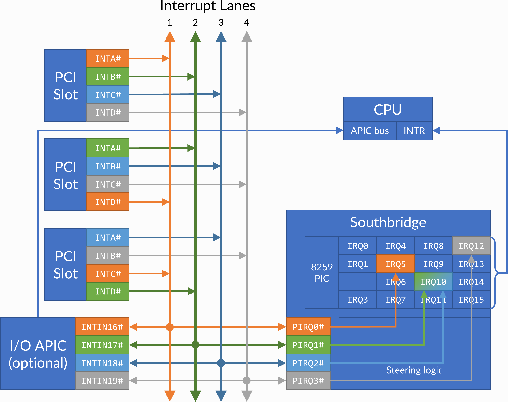

PCI
===

**PCI devices** are more complex than ISA devices; they are individually addressable through a **device number**, and contain a :ref:`configuration space <dev/api/pci:Configuration space>` for configuring several aspects of the device.

Adding a device
---------------

PCI devices can be added with the ``pci_add_card`` function in the device's ``init`` callback. A PCI slot is :ref:`automatically selected <dev/api/pci:Slot types>` for the device according to the ``add_type``; if the emulated machine runs out of slots, a **DEC 21150** PCI-PCI bridge is automatically deployed to add 9 more slots, and new devices are placed in the secondary PCI bus under it.

.. container:: toggle

    .. container:: toggle-header

        Code example: adding a PCI device

    .. code-block::

        #include <86box/device.h>
        #include <86box/pci.h>

        typedef struct {
            int     slot;
            uint8_t pci_regs[256]; /* 256*8-bit configuration register array */
        } foo_t;

        static uint8_t
        foo_pci_read(int func, int addr, void *priv)
        {
            /* Get the device state structure. */
            foo_t *dev = (foo_t *) priv;

            /* Ignore unknown functions. */
            if (func > 0)
                return 0xff;

            /* Read configuration space register. */
            return dev->pci_regs[addr];
        }

        static void
        foo_pci_write(int func, int addr, uint8_t val, void *priv)
        {
            /* Get the device state structure. */
            foo_t *dev = (foo_t *) priv;

            /* Ignore unknown functions. */
            if (func > 0)
                return;

            /* Write configuration space register. */
            dev->pci_regs[addr] = val;
        }

        static void *
        foo_init(const device_t *info)
        {
            /* Allocate the device state structure. */
            foo_t *dev = /* ... */

            /* Add PCI device. */
            dev->slot = pci_add_card(PCI_ADD_NORMAL, foo_pci_read, foo_pci_write, dev);

            return dev;
        }

        const device_t foo4321_device = {
            .name = "Foo-4321",
            .internal_name = "foo4321",
            .flags = DEVICE_PCI,
            .local = 4321,
            .init = foo_init,
            /* ... */
        };

.. flat-table:: ``pci_add_card``
  :header-rows: 1
  :widths: 1 999

  * - Parameter
    - Description

  * - ``add_type``
    - :ref:`PCI slot type <dev/api/pci:Slot types>` to add this card to.

  * - ``read``
    - :ref:`Configuration space <dev/api/pci:Configuration space>` register read callback. Takes the form of:

      ``uint8_t read(int func, int addr, void *priv)``

      * ``func``: :ref:`PCI function <dev/api/pci:Multi-function devices>` number;
      * ``addr``: configuration space register index being read;
      * ``priv``: opaque pointer (see ``priv`` below);
      * Return value: 8-bit value read from this register index.

  * - ``write``
    - :ref:`Configuration space <dev/api/pci:Configuration space>` register write callback. Takes the form of:

      ``void write(int func, int addr, uint8_t val, void *priv)``

      * ``func``: :ref:`PCI function <dev/api/pci:Multi-function devices>` number;
      * ``addr``: configuration space register index being written;
      * ``val``: 8-bit value being written from this register index.
      * ``priv``: opaque pointer (see ``priv`` below);

  * - ``priv``
    - Opaque pointer passed to this device's configuration space register read/write callbacks.
      Usually a pointer to a device's :ref:`state structure <dev/api/device:State structure>`.

  * - **Return value**
    - ``int`` value (subject to change in the future) representing the newly-added device.

Slot types
----------

A machine may declare **special PCI slots** for specific purposes, such as on-board PCI devices which don't correspond to a physical slot. The ``add_type`` parameter to ``pci_add_card`` determines which kind of slot the device should be placed in:

* ``PCI_ADD_NORMAL``: normal 32-bit PCI slot;
* ``PCI_ADD_AGP``: AGP slot (AGP is a superset of PCI);
* ``PCI_ADD_VIDEO``: on-board video controller;
* ``PCI_ADD_SCSI``: on-board SCSI controller;
* ``PCI_ADD_SOUND``: on-board sound controller;
* ``PCI_ADD_IDE``: on-board IDE controller;
* ``PCI_ADD_NETWORK``: on-board network controller;
* ``PCI_ADD_NORTHBRIDGE``, ``PCI_ADD_AGPBRIDGE``, ``PCI_ADD_SOUTHBRIDGE``: reserved for the chipset.

A device available both as a discrete card and as an on-board device should have different ``device_t`` objects with unique ``local`` values to set both variants apart.

.. container:: toggle

    .. container:: toggle-header

        Code example: device available as both discrete and on-board

    .. code-block::

        #include <86box/device.h>
        #include <86box/pci.h>

        #define FOO_ONBOARD 0x80000000  /* most significant bit set = on-board */

        typedef struct {
            int slot;
        } foo_t;

        static void *
        foo_init(const device_t *info)
        {
            /* Allocate the device state structure. */
            foo_t *dev = /* ... */

            /* Add PCI device. The normal variant goes in any normal slot,
               and the on-board variant goes in the on-board SCSI "slot". */
            dev->slot = pci_add_card((info->local & FOO_ONBOARD) ? PCI_ADD_SCSI : PCI_ADD_NORMAL,
                                     foo_pci_read, foo_pci_write, dev);

            return dev;
        }

        const device_t foo4321_device = {
            .name = "Foo-4321",
            .internal_name = "foo4321",
            .flags = DEVICE_PCI,
            .local = 4321, /* on-board bit not set */
            .init = foo_init,
            /* ... */
        };

        const device_t foo4321_onboard_device = {
            .name = "Foo-4321 (On-Board)",
            .internal_name = "foo4321_onboard",
            .flags = DEVICE_PCI,
            .local = 4321 | FOO_ONBOARD, /* on-board bit set */
            .init = foo_init,
            /* ... */
        };

Configuration space
-------------------

The PCI configuration space is split into a `standard register set <https://wiki.osdev.org/PCI#PCI_Device_Structure>`_ from ``0x00`` through ``0x3f``, and device-specific registers from ``0x40`` through ``0xff``. Not all standard registers are present or writable (partially or fully) on all devices; consult the documentation for the device you're trying to implement to determine which registers and bits are present or writable.

.. note:: The documentation for some devices may treat configuration space registers as 16- or 32-bit-wide. Since 86Box works with 8-bit-wide registers, make sure to translate all wider register offsets and bit numbers into individual bytes (in little endian / least significant byte first).

.. important:: Aside from the configuration space, devices will very often have a different set of registers in :ref:`I/O or memory space <dev/api/pci:Base Address Registers>`; from now on, "registers" will refer to configuration space registers.

The most important registers in the standard set are:

.. flat-table::
  :header-rows: 1
  :widths: 1 1 999

  * - Offsets
    - Register
    - Description

  * - ``0x00 - 0x01``
    - Vendor ID
    - :rspan:`1` Unique IDs assigned to the device's vendor (2 bytes) and the device itself (2 more bytes). The `PCI ID Repository <https://pci-ids.ucw.cz>`_ is a comprehensive repository of many (but not all) known PCI IDs.

  * - ``0x02 - 0x03``
    - Device ID

  * - ``0x04 - 0x05``
    - Command
    - Control several core aspects of the PCI device:

      * **I/O Space** (bit 0 or ``0x0001``) should enable all I/O base address registers if set, or disable them if cleared;
      * **Memory Space** (bit 1 or ``0x0002``) should enable all memory base address registers if set, or disable them if cleared;
      * **Interrupt Disable** (bit 10 or ``0x0400``) should prevent the device from triggering interrupts if set.
 
  * - ``0x0e``
    - Header type
    - Usually ``0`` to indicate a normal PCI header.
      Bit 7 (``0x80``) must be set if this is the first function (function ``0``) of a :ref:`multi-function device <dev/api/pci:Multi-function devices>`.

  * - ``0x10 - 0x27``
    - :ref:`dev/api/pci:Base Address Registers`
    - Sets the base address for each memory or :doc:`I/O <io>` range provided by this device.

  * - ``0x2c - 0x2d``
    - Subvendor ID
    - :rspan:`1` Unique vendor (2 bytes) and device (2 bytes) IDs sometimes assigned to different implementations of the same PCI device without having to change the main Vendor and Device IDs.
      Usually all ``0`` if the device doesn't call for such IDs.

  * - ``0x2e - 0x2f``
    - Subsystem ID

  * - ``0x30 - 0x33``
    - Expansion ROM
    - Base address and enable bit for the device's :ref:`option ROM <dev/api/pci:Option ROM>`.
      Must be read-only if the device does not provide an option ROM.

  * - ``0x3c``
    - Interrupt Line
    - The PIC IRQ number assigned to this device's :ref:`interrupt pin <dev/api/pci:Interrupts>` (see ``Interrupt Pin`` below).
      While this register's contents should not be used by the device, the register itself **must be writable** if the device uses interrupts.

  * - ``0x3d``
    - Interrupt Pin
    - Read-only value indicating the PCI :ref:`interrupt pin <dev/api/pci:Interrupts>` (``INTx#``) used by this device:

      * ``0`` if the device does not use interrupts;
      * ``PCI_INTA`` to indicate the ``INTA#`` pin is used (most devices use this);
      * ``PCI_INTB`` to indicate the ``INTB#`` pin is used;
      * ``PCI_INTC`` to indicate the ``INTC#`` pin is used;
      * ``PCI_INTD`` to indicate the ``INTD#`` pin is used.

Multi-function devices
----------------------

PCI defines the concept of **functions**, which allow a physical device to contain up to 8 sub-devices (numbered from ``0`` to ``7``), each with their **own configuration space**, and their **own resources** controlled by :ref:`dev/api/pci:Base Address Registers`. Most (but not all) multi-function PCI devices are chipset southbridges, which may implement a function for the PCI-ISA bridge (and general configuration), another one for the IDE controller, one or more for USB and so on.

The ``func`` parameter passed to a device's configuration space read/write callbacks provides the **function number** for which the configuration space is being accessed. There are two main requirements for implementing multi-function devices:

1. The first function (function ``0``) must have bit 7 (``0x80``) of the Header Type (``0x0e``) register set;
2. Unused functions must return ``0xff`` on all configuration register reads and should ignore writes.

.. container:: toggle

    .. container:: toggle-header

        Code example: device with two functions

    .. code-block::

        typedef struct {
            int     slot;
            uint8_t pci_regs[2][256]; /* two 256*8-bit configuration register arrays,
                                         one for each function */
        } foo_t;

        static uint8_t
        foo_pci_read(int func, int addr, void *priv)
        {
            /* Get the device state structure. */
            foo_t *dev = (foo_t *) priv;

            /* Read configuration space register on the given function. */
            switch (func) {
                case 0: /* function 0 */
                    return dev->pci_regs[0][addr];

                case 1: /* function 1 */
                    return dev->pci_regs[1][addr];

                default: /* out of range */
                    return 0xff;
            }
        }

        static void
        foo_pci_write(int func, int addr, uint8_t val, void *priv)
        {
            /* Get the device state structure. */
            foo_t *dev = (foo_t *) priv;

            /* Write configuration space register on the given function. */
            switch (func) {
                case 0: /* function 0 */
                    dev->pci_regs[0][addr] = val;
                    break;

                case 1: /* function 1 */
                    dev->pci_regs[1][addr] = val;
                    break;

                default: /* out of range */
                    break;
            }
        }

        static void
        foo_reset(void *priv)
        {
            /* Get the device state structure. */
            foo_t *dev = (foo_t *) priv;

            /* Reset PCI configuration registers. */
            memset(dev->pci_regs[0], 0, sizeof(dev->pci_regs[0]));
            memset(dev->pci_regs[1], 0, sizeof(dev->pci_regs[1]));

            /* Write default vendor IDs, device IDs, etc. */

            /* Flag this device as multi-function. */
            dev->pci_regs[0][0x0e] = 0x80;
        }

        static void *
        foo_init(const device_t *info)
        {
            /* Allocate the device state structure. */
            foo_t *dev = /* ... */

            /* Add PCI device. No changes are required here for multi-function devices. */
            dev->slot = pci_add_card(PCI_ADD_NORMAL, foo_pci_read, foo_pci_write, dev);

            /* Initialize PCI configuration registers. */
            foo_reset(dev);

            return dev;
        }

        const device_t foo4321_device = {
            /* ... */
            .init = foo_init,
            .reset = foo_reset,
            /* ... */
        };

Base Address Registers
----------------------

Each function may contain up to six **Base Address Registers** (BARs), which determine the base and size of a **memory** or **I/O** resource provided by the device. The base address may be set by the BIOS and/or operating system during boot. Each 4-byte BAR has two parts:

* The most significant bits store the resource's base address, **aligned** to its size;
* The least significant bits are **read-only** flags related to the BAR:

  * Bit 0 is the **resource type**: ``0`` for memory or ``1`` for :doc:`I/O <io>`;
  * Bits 1-3 on memory BARs are **positioning flags** not really relevant to the context of 86Box;
  * Bit 1 on I/O BARs is **reserved** and must be ``0``.

The aforementioned base address alignment allows software (BIOSes and operating systems) to tell how big a BAR resource is, by checking how many base address bits are writable. All bits ranging from the end of the flags to the start of the base address must be read-only and always read ``0``; for example, on a memory BAR that is 4 KB (4096 bytes) large, bits 31-12 must be writable (creating a 4096-byte alignment), bits 11-4 must read ``0``, and bits 3-0 must read the BAR flags.

.. note:: The minimum BAR sizes are 4 KB for memory and 4 ports for I/O. While memory BARs can technically be as small as 16 bytes, 86Box can only handle device memory in aligned 4 KB increments.

.. container:: bit-table

  .. flat-table:: Memory BAR (example: 4 KB large, starting at ``0x10``)
    :header-rows: 2
    :stub-columns: 1

    * - Byte
      - :cspan:`7` ``0x13``
      - :cspan:`7` ``0x12``
      - :cspan:`7` ``0x11``
      - :cspan:`7` ``0x10``

    * - Bit
      - 31
      - 30
      - 29
      - 28
      - 27
      - 26
      - 25
      - 24
      - 23
      - 22
      - 21
      - 20
      - 19
      - 18
      - 17
      - 16
      - 15
      - 14
      - 13
      - 12
      - 11
      - 10
      - 9
      - 8
      - 7
      - 6
      - 5
      - 4
      - 3
      - 2
      - 1
      - 0

    * - Value
      - :cspan:`19` Base memory address (4096-byte aligned)
      - :cspan:`7` Always ``0``
      - :cspan:`2`

        .. raw:: html

          <abbr title="Read-only">Flags
      - ``0``

  .. flat-table:: I/O BAR (example: 64 ports large, starting at ``0x14``)
    :header-rows: 2
    :stub-columns: 1

    * - Byte
      - :cspan:`7` ``0x17``
      - :cspan:`7` ``0x16``
      - :cspan:`7` ``0x15``
      - :cspan:`7` ``0x14``

    * - Bit
      - 31
      - 30
      - 29
      - 28
      - 27
      - 26
      - 25
      - 24
      - 23
      - 22
      - 21
      - 20
      - 19
      - 18
      - 17
      - 16
      - 15
      - 14
      - 13
      - 12
      - 11
      - 10
      - 9
      - 8
      - 7
      - 6
      - 5
      - 4
      - 3
      - 2
      - 1
      - 0

    * - Value
      - :cspan:`15` Ignored (``0`` recommended)
      - :cspan:`9` Base :doc:`I/O port <io>` (64-byte aligned)
      - :cspan:`3` Always ``0``
      - .. raw:: html

          <abbr title="Reserved (read-only)">R</abbr>
      - ``1``

.. container:: toggle

    .. container:: toggle-header

        Code example: memory and I/O BARs described above

    .. code-block::

        #include <86box/io.h>
        #include <86box/mem.h>

        typedef struct {
            uint8_t       pci_regs[256];
            uint16_t      io_base;
            mem_mapping_t mem_mapping;
        } foo_t;

        static void
        foo_remap_mem(foo_t *dev)
        {
            if (dev->pci_regs[0x04] & 0x02) {
                /* Memory Space bit set, apply the base address.
                   Least significant bits are masked off to maintain 4096-byte alignment.
                   We skip reading dev->pci_regs[0x10] as it contains nothing of interest. */
                mem_mapping_set_addr(&dev->mem_mapping,
                                     ((dev->pci_regs[0x11] << 8) | (dev->pci_regs[0x12] << 16) | (dev->pci_regs[0x13] << 24)) & 0xfffff000,
                                     4096);
            } else {
                /* Memory Space bit not set, disable the mapping. */
                mem_mapping_set_addr(&dev->mem_mapping, 0, 0);
            }
        }

        static void
        foo_remap_io(foo_t *dev)
        {
            /* Remove existing I/O handler if present. */
            if (dev->io_base)
                io_removehandler(dev->io_base, 64,
                                 foo_io_inb, foo_io_inw, foo_io_inl,
                                 foo_io_outb, foo_io_outw, foo_io_outl, dev);

            if (dev->pci_regs[0x04] & 0x01) {
                /* I/O Space bit set, read the base address.
                   Least significant bits are masked off to maintain 64-byte alignment. */
                dev->io_base = (dev->pci_regs[0x14] | (dev->pci_regs[0x15] << 8)) & 0xffc0;
            } else {
                /* I/O Space bit not set, don't do anything. */
                dev->io_base = 0;
            }

            /* Add new I/O handler if required. */
            if (dev->io_base)
                io_sethandler(dev->io_base, 64,
                              foo_io_inb, foo_io_inw, foo_io_inl,
                              foo_io_outb, foo_io_outw, foo_io_outl, dev);
        }

        static void
        foo_pci_write(int func, int addr, uint8_t val, void *priv)
        {
            /* Get the device state structure. */
            foo_t *dev = (foo_t *) priv;

            /* Ignore unknown functions. */
            if (func > 0)
                return;

            /* Write configuration space register. */
            switch (addr) {
                case 0x04:
                    /* Our device only supports the I/O and Memory Space bits of the Command register. */
                    dev->pci_regs[addr] = val & 0x03;

                    /* Update memory and I/O spaces. */
                    foo_remap_mem(dev);
                    foo_remap_io(dev);
                    break;

                case 0x10:
                    /* Least significant byte of the memory BAR is read-only. */
                    break;

                case 0x11:
                    /* 2nd byte of the memory BAR is masked to maintain 4096-byte alignment. */
                    dev->pci_regs[addr] = val & 0xf0;

                    /* Update memory space. */
                    foo_remap_mem(dev);
                    break;

                case 0x12: case 0x13:
                    /* 3rd and most significant bytes of the memory BAR are fully writable. */
                    dev->pci_regs[addr] = val;

                    /* Update memory space. */
                    foo_remap_mem(dev);
                    break;

                case 0x14:
                    /* Least significant byte of the I/O BAR is masked to maintain 64-byte alignment, and
                       ORed with the default value's least significant bits so that the flags stay in place. */
                    dev->pci_regs[addr] = (val & 0xc0) | (dev->pci_regs[addr] & 0x03);

                    /* Update I/O space. */
                    foo_remap_io(dev);
                    break;

                case 0x15:
                    /* Most significant byte of the I/O BAR is fully writable. */
                    dev->pci_regs[addr] = val;

                    /* Update I/O space. */
                    foo_remap_io(dev);
                    break;

                case 0x16: case 0x17:
                    /* I/O BARs are only 2 bytes long, ignore the rest. */
                    break;
            }
        }

        static void
        foo_reset(void *priv)
        {
            /* Get the device state structure. */
            foo_t *dev = (foo_t *) dev;

            /* Reset PCI configuration registers. */
            memset(dev->pci_regs, 0, sizeof(dev->pci_regs));

            /* Write default vendor ID, device ID, etc. */

            /* The BAR at 0x10-0x13 is a memory BAR. */
            //dev->pci_regs[0x10] = 0x00; /* least significant bit already not set = memory */

            /* The BAR at 0x14-0x17 is an I/O BAR. */
            dev->pci_regs[0x14] = 0x01; /* least significant bit set = I/O */

            /* Clear all BAR memory mappings and I/O handlers. */
            //dev->pci_regs[0x04] = 0x00; /* Memory and I/O Space bits already cleared */
            foo_remap_mem(dev);
            foo_remap_io(dev);
        }

        /* Don't forget to add the PCI device on init first. */

        const device_t foo4321_device = {
            /* ... */
            .reset = foo_reset,
            /* ... */
        };

Option ROM
----------

A PCI function may have an **option ROM**, which behaves similarly to a :ref:`memory BAR <dev/api/pci:Base Address Registers>` in that the ROM can be mapped to any address in 32-bit memory space, aligned to its size. As with BARs, the BIOS and/or operating system takes care of mapping; for example, a BIOS will map the primary PCI video card's ROM to the legacy ``0xc0000`` address.

The main difference between this register and BARs is that the ROM can be enabled or disabled through bit 0 (``0x01``) of this register. Both that bit and the Command (``0x04``) register's Memory Space bit (bit 1 or ``0x02``) must be set for the ROM to be accessible.

.. note:: The minimum size for an option ROM is 4 KB (see the note about 86Box memory limitations in the :ref:`BAR <dev/api/pci:Base Address Registers>` section), and the maximum size is 16 MB.

.. container:: bit-table

  .. flat-table:: Option ROM (example: 32 KB large)
    :header-rows: 2
    :stub-columns: 1

    * - Byte
      - :cspan:`7` ``0x33``
      - :cspan:`7` ``0x32``
      - :cspan:`7` ``0x31``
      - :cspan:`7` ``0x30``

    * - Bit
      - 31
      - 30
      - 29
      - 28
      - 27
      - 26
      - 25
      - 24
      - 23
      - 22
      - 21
      - 20
      - 19
      - 18
      - 17
      - 16
      - 15
      - 14
      - 13
      - 12
      - 11
      - 10
      - 9
      - 8
      - 7
      - 6
      - 5
      - 4
      - 3
      - 2
      - 1
      - 0

    * - Value
      - :cspan:`16` Base memory address (32768-byte aligned)
      - :cspan:`13` Always ``0``
      - .. raw:: html

          <abbr title="ROM Enable">E

.. container:: toggle

    .. container:: toggle-header

        Code example: 32 KB option ROM

    .. code-block::

        #include <86box/mem.h>
        #include <86box/rom.h>

        typedef struct {
            uint8_t pci_regs[256];
            rom_t   rom;
        } foo_t;

        static void
        foo_remap_rom(foo_t *dev)
        {
            if ((dev->pci_regs[0x30] & 0x01) && (dev->pci_regs[0x04] & 0x02)) {
                /* Expansion ROM Enable and Memory Space bits set, apply the base address.
                   Least significant bits are masked off to maintain 32768-byte alignment.
                   We skip reading dev->pci_regs[0x30] as it contains nothing of interest. */
                mem_mapping_set_addr(&dev->rom.mapping,
                                     ((dev->pci_regs[0x31] << 8) | (dev->pci_regs[0x32] << 16) | (dev->pci_regs[0x33] << 24)) & 0xffff8000,
                                     4096);
            } else {
                /* Expansion ROM Enable and/or Memory Space bits not set, disable the mapping. */
                mem_mapping_set_addr(&dev->rom.mapping, 0, 0);
            }
        }

        static void
        foo_pci_write(int func, int addr, uint8_t val, void *priv)
        {
            /* Get the device state structure. */
            foo_t *dev = (foo_t *) priv;

            /* Ignore unknown functions. */
            if (func > 0)
                return;

            /* Write configuration space register. */
            switch (addr) {
                case 0x04:
                    /* Our device only supports the Memory Space bit of the Command register. */
                    dev->pci_regs[addr] = val & 0x02;

                    /* Update ROM space. */
                    foo_remap_rom(dev);
                    break;

                case 0x30:
                    /* Least significant byte of the ROM address is read-only, except for the enable bit. */
                    dev->pci_regs[addr] = val & 0x01;

                    /* Update ROM space. */
                    foo_remap_rom(dev);
                    break;

                case 0x31:
                    /* 2nd byte of the ROM address is masked to maintain 32768-byte alignment. */
                    dev->pci_regs[addr] = val & 0x80;

                    /* Update ROM space. */
                    foo_remap_rom(dev);
                    break;

                case 0x32: case 0x33:
                    /* 3rd and most significant bytes of the ROM address are fully writable. */
                    dev->pci_regs[addr] = val;

                    /* Update ROM space. */
                    foo_remap_rom(dev);
                    break;
            }
        }

        static void
        foo_reset(void *priv)
        {
            /* Get the device state structure. */
            foo_t *dev = (foo_t *) dev;

            /* Reset PCI configuration registers. */
            memset(dev->pci_regs, 0, sizeof(dev->pci_regs));

            /* Write default vendor ID, device ID, etc. */

            /* Clear ROM memory mapping. */
            //dev->pci_regs[0x04] = 0x00; /* Memory Space bit already cleared */
            //dev->pci_regs[0x30] = 0x00; /* Expansion ROM Enable bit already cleared */
            foo_remap_rom(dev);
        }

        static int
        foo4321_available()
        {
            /* This device can only be used if its ROM is present. */
            return rom_present("roms/scsi/foo/foo4321.bin");
        }

        static void *
        foo_init(const device_t *info)
        {
            /* Allocate the device state structure. */
            foo_t *dev = /* ... */

            /* Don't forget to add the PCI device first. */

            /* Load 32 KB ROM... */
            rom_init(&dev->rom, "roms/scsi/foo/foo4321.bin", 0, 0x8000, 0x7fff, 0, MEM_MAPPING_EXTERNAL);

            /* ...but don't map it right now. */
            mem_mapping_disable(&dev->rom.mapping);

            /* Initialize PCI configuration registers. */
            foo_reset(dev);

            return dev;
        }

        const device_t foo4321_device = {
            /* ... */
            .init = foo_init,
            .reset = foo_reset,
            { .available = foo4321_available },
            /* ... */
        };

Interrupts
----------

PCI devices can assert an interrupt on one of four **interrupt pins** called ``INTA#``, ``INTB#``, ``INTC#`` and ``INTD#``. Each function can only use one of these pins, specified by read-only register ``0x3d``. Each pin is connected to a system-wide **interrupt lane** (most chipsets provide 4 lanes), which is then routed to a PIC or APIC IRQ at boot time by the BIOS and/or operating system, through a process called **steering**. Different interrupt pins on different devices may share the same lane, and more than one lane may share the same PIC IRQ (or APIC IRQ if the APIC has no dedicated PCI interrupt inputs).

The diagram below exemplifies a system with **interrupt steering performed by the chipset**. Early PCI chipsets are not capable of steering by themselves, instead requiring interrupt lanes to be manually routed to PIC IRQs using **jumpers** and the BIOS to be configured accordingly. On machines with non-steering-capable chipsets, 86Box skips the jumpers and uses the IRQs configured in the BIOS; this is done by snooping on the values the BIOS writes to register ``0x3c``.

   PCI interrupt topology example. IRQ 10 is shared by two interrupt lanes. The machine is free to route any ``INTx#`` pin to any lane (sequentially or not), and free to route any lane to any available IRQ.

An emulated PCI device can assert or de-assert an interrupt on any pin with the ``pci_set_irq`` and ``pci_clear_irq`` functions respectively. The PCI subsystem transparently handles interrupt lane routing (using the per-machine PCI slot table), sharing and steering. Once an interrupt is asserted, a device usually de-asserts it when an **interrupt flag** is cleared or an **interrupt mask flag** is set in its configuration, I/O or memory register space.

.. container:: toggle

    .. container:: toggle-header

        Code example: PCI interrupts

    .. code-block::

        #include <86box/pci.h>

        static void
        foo_pci_write(int func, int addr, uint8_t val, void *priv)
        {
            /* Get the device state structure. */
            foo_t *dev = (foo_t *) priv;

            /* Ignore unknown functions. */
            if (func > 0)
                return;

            /* The Interrupt Line register must be writable for 86Box to
               know the IRQ to use on machines with non-steering chipsets. */
            if (addr == 0x3c) {
                dev->pci_regs[0x3c] = val;
                return;
            }

            /* Example: PCI configuration register 0x40:
               - Bit 0 (0x01) set: manually assert interrupt;
               - Bit 0 (0x01) clear: de-assert interrupt. */
            if (addr == 0x40) {
                dev->pci_regs[0x40] = val;
                if (val & 0x01)
                    pci_set_irq(dev->slot, PCI_INTA);
                else
                    pci_clear_irq(dev->slot, PCI_INTA);
            }
        }

        static void
        foo_reset(void *priv)
        {
            /* Get the device state structure. */
            foo_t *dev = (foo_t *) dev;

            /* Reset PCI configuration registers. */
            memset(dev->pci_regs, 0, sizeof(dev->pci_regs));

            /* Write default vendor ID, device ID, etc. */

            /* Our device uses the INTA# interrupt line. */
            dev->pci_regs[0x3d] = PCI_INTA;
        }

        /* Don't forget to add the PCI device on init first, and to save
           the return value of pci_add_card (to dev->slot in this case). */

        const device_t foo4321_device = {
            /* ... */
            .reset = foo_reset,
            /* ... */
        };

.. flat-table:: ``pci_set_irq`` / ``pci_clear_irq``
  :header-rows: 1
  :widths: 1 999

  * - Parameter
    - Description

  * - ``card``
    - Value representing this PCI device, returned by ``pci_add_card``.

  * - ``pci_int``
    - Interrupt pin to assert (``pci_set_irq``) or de-assert (``pci_clear_irq``): ``PCI_INTA``, ``PCI_INTB``, ``PCI_INTC`` or ``PCI_INTD``.

Motherboard interrupts
^^^^^^^^^^^^^^^^^^^^^^

Some chipsets may provide steerable **motherboard IRQ** (MIRQ) lines for on-board devices to use. The amount of available lines depends on the chipset, and the purposes for those lines depend on the machine. 86Box supports up to 8 MIRQ lines, which can be asserted or de-asserted with the ``pci_set_mirq`` and ``pci_clear_mirq`` functions respectively.

.. flat-table:: ``pci_set_mirq`` / ``pci_clear_mirq``
  :header-rows: 1
  :widths: 1 999

  * - Parameter
    - Description

  * - ``mirq``
    - MIRQ line to assert (``pci_set_mirq``) or de-assert (``pci_clear_mirq``): ``PCI_MIRQ0`` through ``PCI_MIRQ7``.

  * - ``level``
    - ``1`` if this MIRQ should be level-triggered, ``0`` if it should be edge-triggered.
