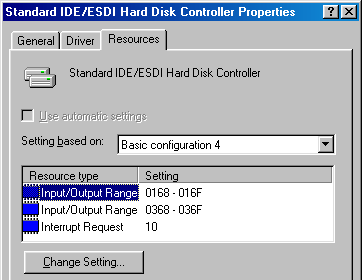

Tertiary and quaternary IDE
===========================

The additional tertiary and quaternary IDE controllers, enabled through the :ref:`Storage controllers <settings/storage:Tertiary / Quaternary IDE Controller>` settings page, are not supported by all emulated BIOSes and may require manual configuration of emulated operating systems. The specific details are outlined on this page.

System resources
----------------

The following resources are used by these additional controllers:

+----------+-------------+---------------+---+
|Channel   |Main I/O port|Status I/O port|IRQ|
+==========+=============+===============+===+
|Tertiary  |0168h        |036Eh          |10 |
+----------+-------------+---------------+---+
|Quaternary|01E8h        |03EEh          |11 |
+----------+-------------+---------------+---+

These controllers are not Plug and Play compliant. If the emulated machine supports Plug and Play (through ISA, PCI or other means), remember to mark the IRQ(s) as being used by a legacy ISA device in the BIOS setup utility.

.. note:: While the IRQ for each channel can be changed through its respective *Settings* button on :ref:`settings/storage:Tertiary / Quaternary IDE Controller`, many operating systems do not allow legacy (ISA or VLB) IDE controllers to use custom IRQs.

BIOS support
------------

The tertiary and quaternary channels are not visible and not bootable by any BIOS currently emulated by 86Box. The only exception is **MR BIOS version 3**, which provides full support for them, including bootability and INT 13h services.

Operating system support
------------------------

DOS and real mode
^^^^^^^^^^^^^^^^^

DOS and other real mode operating systems rely on INT 13h services provided by the BIOS to access hard disks. These are only provided for the tertiary and quaternary channels by **MR BIOS version 3**, as mentioned above.

Windows 95, 98 and Me
^^^^^^^^^^^^^^^^^^^^^

The Windows 9x family will only detect and enable both additional channels during installation :ref:`if the BIOS supports them <hardware/ideterqua:BIOS support>`. Each additional channel can be enabled after installation through the following steps:

1. Go to the *Add New Hardware* control panel.
2. Add a *Standard IDE/ESDI Hard Disk Controller* from the *Hard disk controllers* category.
3. Don't restart the system when asked to.
4. Go to the *Device Manager* tab of the *System* control panel.
5. Select the newly-added *Standard IDE/ESDI Hard Disk Controller* device from the *Hard disk controllers* category and click *Properties*.
6. Go to the *Resources* tab.
7. Select *Basic configuration 4* in the *Settings based on* box.
8. Change the resource settings to match the :ref:`table above <hardware/ideterqua:System resources>`. The first *Input/Output Range* range corresponds to the **main** I/O port, the second one corresponds to the **status** I/O port, and *Interrupt Request* corresponds to the IRQ.

   * The status I/O port range is off by 6 units. Select 0368 for the tertiary channel or 03E8 for the quaternary channel.
   * The image below shows an example configuration for the tertiary channel.

9. If both the tertiary and quaternary channels are enabled, repeat the steps above to add the other channel.

Windows NT, 2000 and XP
^^^^^^^^^^^^^^^^^^^^^^^

The Windows NT family (from 3.5 to XP) will automatically detect and enable both additional channels during installation, regardless of BIOS support. This auto-detection does not, however, work on machines with **Award BIOS**, except for the version which identifies itself as *Phoenix - AwardBIOS v6.00PG*, where it does work.

.. note:: If you install the system to a hard disk on one of the additional channels, it will not be bootable if the BIOS doesn't support booting from these channels.

On Windows 2000 only, the additional channels can be enabled after the system is installed through *Add New Hardware* similarly to Windows 95/98/Me above, although the I/O ports and IRQ cannot be changed. *Basic configuration 0003* corresponds to the **tertiary** channel, while *Basic configuration 0002* corresponds to the **quaternary** channel.

Windows Vista and 7
^^^^^^^^^^^^^^^^^^^

The Windows NT 6 family does not support legacy non-Plug-and-Play IDE controllers, and therefore cannot use the additional channels as currently emulated by 86Box.

Linux
^^^^^

On kernels with ``libata`` (typically 2.6.19 and newer), run the ``modprobe pata_legacy probe_all=1`` command as root to enable both additional channels. Consult your distribution's documentation on how to load that module on startup.

On kernels without ``libata`` (typically older than 2.6.19), add the following parameters to the kernel command line to enable their respective channels:

* **Tertiary:** ``ide2=0x168,0x36e,10`` (assuming IRQ 10)
* **Quaternary:** ``ide3=0x1e8,0x3ee,11`` (assuming IRQ 11)

.. note:: Some Linux distributions may automatically detect and enable both additional channels; however, that is very rarely the case.
