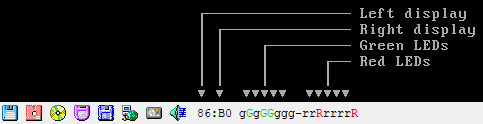

ISABugger
=========

The ISABugger card provides a debugging interface for software developers, consisting of two 8-bit hexadecimal displays and two banks of 8 LEDs, all controlled by the emulated machine. It can be enabled through the :ref:`Peripherals settings page <settings/peripherals:ISABugger>`.

These displays and LEDs are displayed on the :ref:`status bar <usage/statusbar:ISABugger>` as described in the diagram below:

Background
----------

From ``src/device/bugger.c``:

.. code-block:: none

 		Implementation of the ISA Bus (de)Bugger expansion card
 		sold as a DIY kit in the late 1980's in The Netherlands.
 		This card was a assemble-yourself 8bit ISA addon card for
 		PC and AT systems that had several tools to aid in low-
 		level debugging (mostly for faulty BIOSes, bootloaders
 		and system kernels...)
 
 		The standard version had a total of 16 LEDs (8 RED, plus
 		8 GREEN), two 7-segment displays and one 8-position DIP
 		switch block on board for use as debugging tools.
 
 		The "Plus" version, added an extra 2 7-segment displays,
 		as well as a very simple RS-232 serial interface that
 		could be used as a mini-console terminal.

Registers
---------

The ISABugger's control registers can be accessed through the following operations on I/O ports ``0x7a`` and ``0x7b``:

* **Writing:** write the register's index to port ``0x7a``, then write the value to port ``0x7b``.
* **Reading:** write the register's index to port ``0x7a``, then read the value from port ``0x7b``.
* **Index reading:** the last register index written to port ``0x7a`` can be read back from the same port. The most significant bit is always set, as an indicator that the ISABugger is enabled.

.. note:: The ISABugger I/O ports only support byte (``inb``/``outb``) operations. Word (``inw``/``outw``) and dword (``inl``/``outl``) operations will result in undefined behavior; so will selecting or attempting to read back an unknown register index, or performing an illegal operation such as reading from a write-only register.

Register reference
^^^^^^^^^^^^^^^^^^

.. rubric:: Index ``0x00`` - Red LEDs (write-only)
.. rubric:: Index ``0x01`` - Green LEDs (write-only)

Each LED bank shows a binary representation of the 8-bit value written to its register, from the most significant bit on the left to the least significant bit on the right. Setting a bit will light up its corresponding LED (displayed as **G** or **R**), and clearing a bit will dim its LED (displayed as **g** or **r**).

.. rubric:: Index ``0x02`` - Right display (write-only)
.. rubric:: Index ``0x04`` - Left display (write-only)

Each display shows a hexadecimal representation of the 8-bit value written to its register.

.. rubric:: Index ``0x20`` - Serial port data (not implemented) (read/write)
.. rubric:: Index ``0x40`` - Serial port configuration (not implemented) (read/write)

While the aforementioned real ISABugger card is equipped with an independent RS-232 serial interface, that feature is currently not implemented on 86Box in an user-facing manner.

.. rubric:: Index ``0x80`` - Initialize (not implemented) (write-only)

This register has **no effect** on 86Box, as the emulated ISABugger is always enabled and ready.

.. rubric:: Index ``0xff`` - Reset (special)

Writing register index ``0xff`` to port ``0x7a`` will immediately reset all registers to their startup value, clearing all displays and LED banks.

This is a **special register** which cannot be read or written; writing to port ``0x7b`` immediately after a reset will result in the value being sent to the default register index of ``0x00``, which corresponds to the red LEDs.
