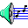

Status bar
==========

The status bar located at the bottom of the 86Box window provides icons related to devices attached to the emulated machine. Move your mouse cursor over an icon to see what device it represents. **Most icons can be clicked on** to access options related to their respective devices, as listed below. Additionally, a green indicator light will appear on an icon when its device is in use, unless :ref:`Update status bar icons <usage/menubar:Tools>` is disabled.

.. |nbsp| unicode:: 0xA0 0xA0
   :trim:

.. |mo| image:: images/mo.png
   :scale: 150%

|floppy_35| |floppy_525| |nbsp| Floppy drives
---------------------------------------------

A 3.5" or 5.25" floppy icon will appear for each configured :ref:`floppy drive <settings/floppycdrom:Floppy drives>`.

* **New image:** create a new disk image file. Opens the *New Image* window, which lets you select the image size and where to save the file.
* **Existing image:** insert a disk image file into this drive.
* **Existing image (Write-protected):** insert a disk image file into this drive as a read-only disk.
* **Export to 86F:** convert the currently-inserted disk image file to 86Box's :doc:`../formats/86f` surface image format. You will be asked where to save the converted file.
* **Eject:** remove the currently-inserted disk from this drive.

|cdrom| |nbsp| CD-ROM drives
----------------------------

A CD icon will appear for each configured :ref:`CD-ROM drive <settings/floppycdrom:CD-ROM drives>`.

* **Mute:** mute any :ref:`usage/diskimages:CD audio` played through this drive. **CD audio is muted by default on all drives.**
* **Empty:** remove any disc inserted into this drive.
* **Reload previous image:** reinsert the last disc image file selected through the *Image* option.
* **Image:** insert a CD-ROM or DVD-ROM disc image into this drive.

|zip| |mo| |nbsp| ZIP and MO drives
-----------------------------------

A ZIP or MO icon will appear for each configured :doc:`additional removable storage drive <../settings/removable>`.

* **New image:** create a new disk image file. Opens the *New Image* window, which lets you select the image size and where to save the file.
* **Existing image:** insert a disk image file into this drive.
* **Existing image (Write-protected):** insert a disk image file into this drive as a read-only disk.
* **Eject:** remove the currently-inserted disk from this drive.
* **Reload previous image:** reinsert the last disk image file selected through the *Existing image* options.

|hard_disk| |nbsp| Hard disks
-----------------------------

A hard disk icon will appear for each configured :doc:`hard disk bus <../settings/hdd>`. For example, if you have both IDE and SCSI hard disks configured, two hard disk icons will appear: one representing all IDE disks, and another one representing all SCSI disks. No options are available.

|network| |nbsp| Network
------------------------

This icon will appear if :doc:`networking <../settings/network>` is enabled. No options are available.

|sound| |nbsp| Sound
--------------------

This icon is always present. Double-clicking it opens a sound gain control, which allows you to increase the loudness of all audio produced by the emulated machine, including the PC speaker and any sound cards.

.. note:: The gain control does not apply to MIDI music sent to a software synthesizer through the :ref:`System MIDI <settings/sound:MIDI Out Device>` device, as these synthesizers are external to 86Box.